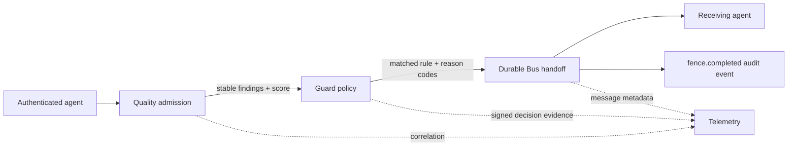

# Fence Flow: Executable Product Contract

The critical distinction is that each stage adds a different property: Quality establishes admissibility, Guard establishes authority, and Bus establishes durable minimum-sufficient transfer. No tier inherits the trust conclusion of another tier.
